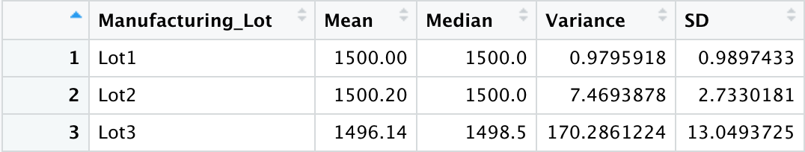
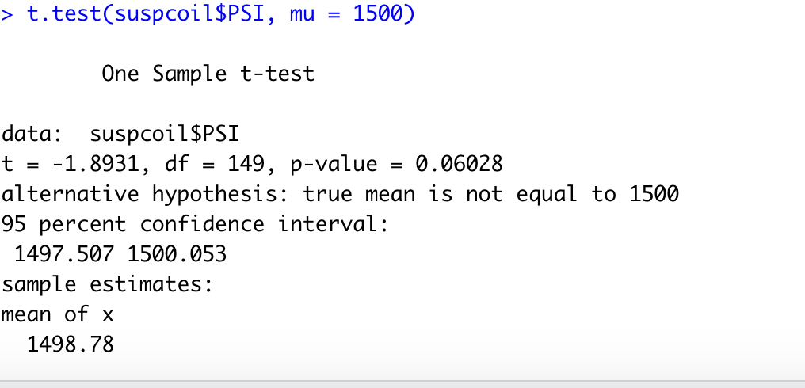
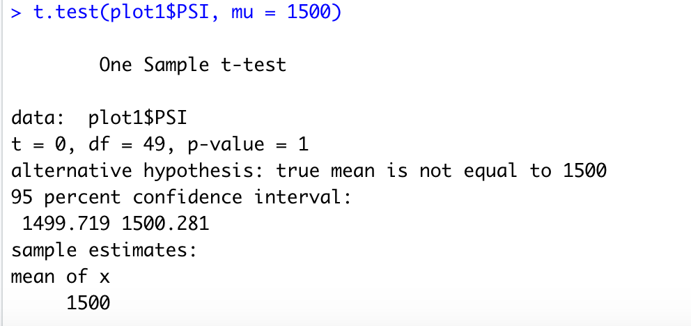
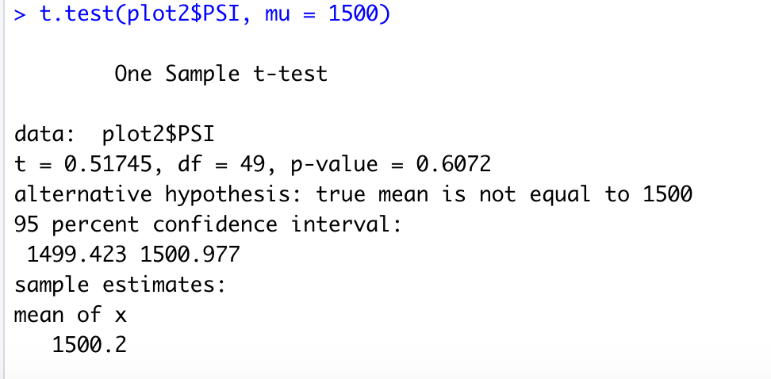
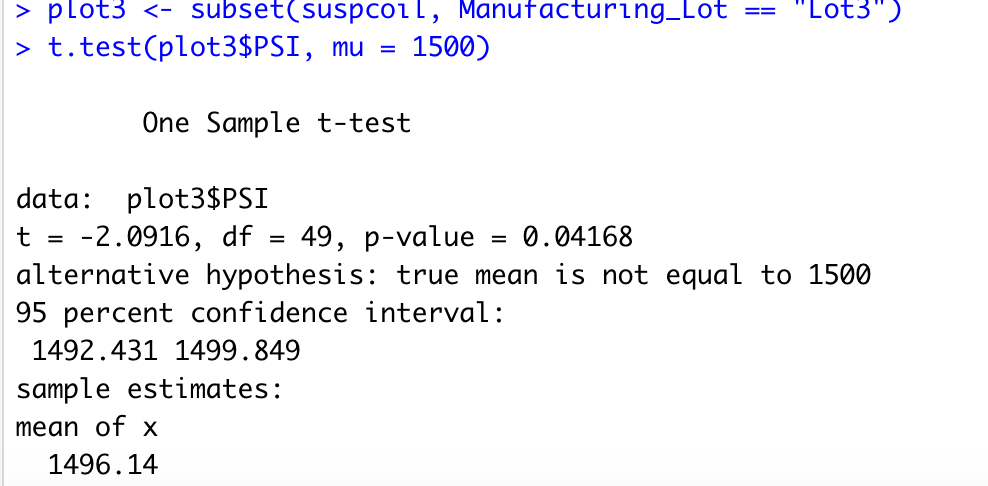

# MechaCar_Statistical_Analysis

## Linear Regression to Predict MPG
 According to the results of the multiple linear regression, vehicle length and ground clearance, as well as intercept are statistically unlikely to provide random amounts of variance to the linear model. The slope of the linear model is not zero, because the the vehicle length and ground clearance have a significant impact on MPG.
 With the R-square value at 0.71, this model explains about 71% of the variability, and the p-value (5.35e-11) is statistically significant. Thus, this regression model would efficiently predict the mpg of MechaCar prototypes with the current dataset. 

## Summary Statistics on Suspension Coils 
The design specifications for the MechaCar suspension coils dictate that the variance of the suspension coils must not exceed 100 pounds per square inch. With this criterion, we can conclude the following: 
 - Lot 1 meets the design specification with a variance of 0.9795918 pounds per square inch 
 - Lot 2 meets the design specification with a variance of 7.4693878 pounds per square inch 
 - Lot 3 does not meet the design specification with a variance of 170.2861224 pounds per square inch
 
 
 
 
 - The total variance from the three lots is 62.29356, which meets the design specification of at most 100 pounds per square inch 
 
  
  
 ## T-Tests on Suspension Coils
  Null Hypothesis: there is no statistical difference between PSI across all manufacturing lots and the population mean of 1,500 pounds per square inch.
  Alternative Hypothesis: there is a statistical difference between PSI across all manufacturing lots and the population mean of 1,500 pounds per square inch.
  Significance level: 0.05 
  With a p-value of 0.06028, the null hypothesis is not rejected. There is no statistical difference between PSI across all manufacturing lots and the population mean of 1,500 pounds per square inch
  
  
  
  Null Hypothesis: there is no statistical difference between PSI in each manufacturing lot and the population mean of 1,500 pounds per square inch.
  Alternative Hypothesis: there is a statistical difference between PSI in each manufacturing lot and the population mean of 1,500 pounds per square inch.
  Significance level: 0.05 
  
  For Manufacturing Lot1, with a p-value of 1, the null hypothesis is not rejected. There is no statistical difference between PSI in Lot1 and the population mean of 1,500 pounds per square inch

 
 
 For Manufacturing Lot2, with a p-value of 0.602, the null hypothesis is not rejected. There is no statistical difference between PSI in Lot2 and the population mean of 1,500 pounds per square inc
 
 
  
 For Manufacturing Lot1, with a p-value of 0.0416, the null hypothesis is rejected. There is a statistical difference between PSI in Lot3 and the population mean of 1,500 pounds per square inc
 
 
 
  
## Study Design: MechaCar vs Competition 
Question: How does MechaCar perform against its competiton? 
 - A few metrics that a consumer may consider when purchasing a car are costs, highway fuel efficiency, maintenance costs, and safety rating. 
 - This study will include a multiple linear regression that would highlight the impact of independent variables (highway fuel efficiency, maintenance costs, and safety ratings) on the dependent variable (the cost of the car). Data on the previously stated metrics would be collected from a similar class of vehicles from both manufacturers. 
 - The null hypotheses is that variance in the dependent variable (cost) is not accounted for in a linear combination of the independent variables (highway fuel efficiency, maintenance costs, safety ratings)
 - The alternative hypotheses is that a linear combination of the independent varibales account for variance in the cost of the car. 
 - If the multiple linear regressions show that the independent variables have a more significant effect on the cost of MechaCar's vehicles than in competitors vehicles which makes MechaCar's vehicles more expensive, MechaCar could re-evaluate production technologies that could reduce their costs. 
