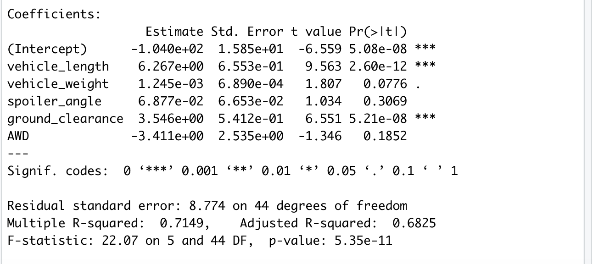

# MechaCar_Statistical_Analysis

## Linear Regression to Predict MPG
 According to the results of the multiple linear regression, vehicle length and ground clearance, as well as intercept are statistically unlikely to provide random amounts of variance to the linear model. The slope of the linear model is not zero, because the the vehicle length and ground clearance have a significant impact on MPG.
 With the R-square value at 0.71, this model explains about 71% of the variability, and the p-value (5.35e-11) is statistically significant. Thus, this regression model would efficiently predict the mpg of MechaCar prototypes with the current dataset. 

